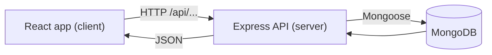

# Chapter 01 - Project Setup and Architecture

**Branch:** `chapter-01-setup`

## Learning goal
Understand what a MERN app is, how the frontend and backend talk to each other,
and how we organise the project folders before writing any code.

## Files added
- `.gitignore` - tells git to skip `node_modules`, `.env`, build output
- `server/` - backend (Node + Express + MongoDB) will live here
- `client/` - frontend (React) will live here
- `docs/` - one markdown file per chapter

## Key concept: the MERN architecture

| Letter | Tool | Job |
|--------|------|-----|
| M | MongoDB | Database - stores products, users, orders |
| E | Express | Backend web framework - exposes a REST API |
| R | React | Frontend UI running in the browser |
| N | Node.js | Runs JavaScript on the server |



The browser never talks to the database directly. It always calls the API, and
the API decides what data to read or write.

### Why two folders?
Frontend and backend are **separate apps** with their own `package.json`.
They can be developed, tested and deployed independently. This is the first
step of a modular design.

## Final folder structure (where we are heading)

```
store2/
  server/src/
    config/       database connection
    models/       data shape (Mongoose schemas)
    controllers/  business logic
    routes/       URL -> controller mapping
    middleware/   reusable checks (auth, errors)
  client/src/
    api/          axios instance
    context/      global state (cart, auth)
    components/   reusable UI pieces
    pages/        one file per screen
```

## How to run
Nothing to run yet. Check you have the tools:

```bash
node -v      # v18 or newer
npm -v
git --version
mongod --version
```

## Exercise
1. Draw the MERN diagram above on paper and explain it to a friend.
2. Think of 3 more features an e-commerce site needs. Which folder would each one touch?
