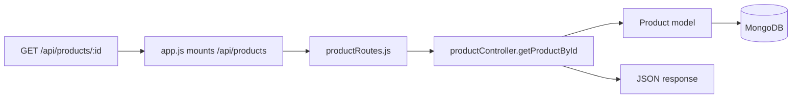

# Chapter 03 - Product API (Model, Controller, Route)

**Branch:** `chapter-03-product-api`

## Learning goal
Build our first real feature, a product API, and learn the **Route, Controller,
Model** pattern that every later feature reuses.

## Files added or changed
```
server/src/
  models/Product.js                 NEW  shape of a product in MongoDB
  controllers/productController.js  NEW  logic: list products, get one product
  routes/productRoutes.js           NEW  maps URLs to controller functions
  seed.js                           NEW  fills the DB with 6 sample products
  app.js                            CHANGED  mounts /api/products
  middleware/error.js               CHANGED  invalid MongoDB id -> 400
server/package.json                 CHANGED  "seed" script
```

## Key concept: how a request flows



Each layer has **one job**:

| Layer | File | Job |
|-------|------|-----|
| Route | `routes/productRoutes.js` | "Which function handles this URL?" |
| Controller | `controllers/productController.js` | "What should happen?" |
| Model | `models/Product.js` | "What does the data look like?" |

```js
// routes/productRoutes.js
router.get('/', getProducts);
router.get('/:id', getProductById);

// controllers/productController.js
export const getProductById = async (req, res) => {
  const product = await Product.findById(req.params.id);
  if (!product) return res.status(404).json({ message: 'Product not found' });
  res.json(product);
};
```

`app.use('/api/products', productRoutes)` adds the prefix, so `'/:id'` in the
router becomes `/api/products/:id`.

## How to run
```bash
cd server
npm run seed     # inserts 6 sample products
npm run dev
```
Test in the browser or with curl:
```bash
curl http://localhost:5050/api/products
curl http://localhost:5050/api/products/<paste-an-_id-here>
curl http://localhost:5050/api/products/abc      # -> 400 Invalid id
```

## Exercise
1. Add a `category` field to the Product model and the seed data.
2. Support `GET /api/products?search=shoe` using `Product.find({ name: { $regex: search, $options: 'i' } })`.
