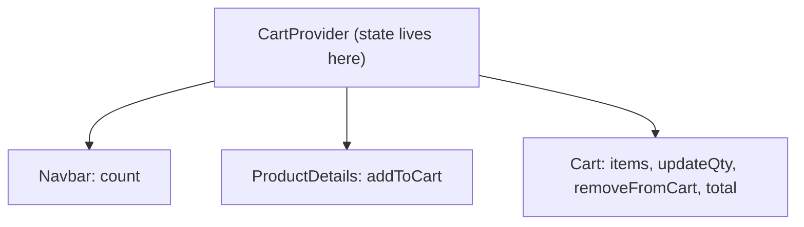

# Chapter 06 - Shopping Cart (React Context + localStorage)

**Branch:** `chapter-06-cart`

## Learning goal
Share cart data between pages using **React Context**, and keep it after a
page refresh with **localStorage**. No backend changes in this chapter.

## Files added or changed
```
client/src/
  context/CartContext.jsx    NEW      cart state + actions (add, update, remove, clear)
  pages/Cart.jsx             NEW      cart table with qty, subtotal, total
  pages/ProductDetails.jsx   CHANGED  "Add to cart" button
  components/Navbar.jsx      CHANGED  shows "Cart (count)"
  main.jsx                   CHANGED  wraps App in <CartProvider>
  App.jsx                    CHANGED  route /cart
```

## Key concepts

### 1. Why Context?
`Navbar` (count), `ProductDetails` (add) and `Cart` (list) all need the same
cart. Passing props through every level gets messy, so one **provider** at the
top holds the state and any component can read it:



### 2. A custom hook hides the details
```js
export const useCart = () => useContext(CartContext);

// in any component
const { addToCart } = useCart();
```

### 3. Persist with localStorage
```js
const [items, setItems] = useState(() => JSON.parse(localStorage.getItem('cart')) || []);
useEffect(() => localStorage.setItem('cart', JSON.stringify(items)), [items]);
```
Load once on start, save whenever `items` changes.

### 4. Derived values
`count` and `total` are **calculated** from `items` with `reduce`. We do not
store them separately, so they can never get out of sync.

## How to run
Same as before. Add products, change quantities, refresh the page; the cart
is still there. (In DevTools, open Application, then Local Storage, then `cart`.)

## Exercise
1. Add a "Clear cart" button on the Cart page (`clearCart` already exists).
2. Stop the user from setting a quantity above `countInStock`.
