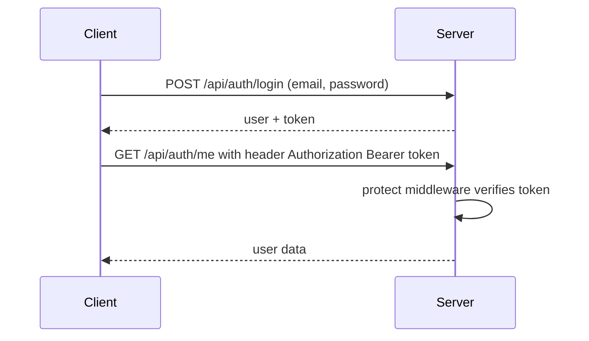

# Chapter 07 - Authentication Backend (bcrypt + JWT)

**Branch:** `chapter-07-auth-backend`

## Learning goal
Let users register and log in safely: store **hashed** passwords, issue a
**JWT token**, and protect routes with **middleware**.

## Files added or changed
```
server/src/
  models/User.js                 NEW      user schema, hashes password before save
  controllers/authController.js  NEW      register, login, getMe
  routes/authRoutes.js           NEW      /api/auth/register, /login, /me
  middleware/auth.js             NEW      protect (logged in?) + admin (is admin?)
  middleware/error.js            CHANGED  validation errors -> 400
  app.js                         CHANGED  mounts /api/auth
  seed.js                        CHANGED  creates an admin and a normal user
server/.env.example              CHANGED  JWT_SECRET
```
New packages: `npm install bcryptjs jsonwebtoken`

## Key concepts

### 1. Never store plain passwords
```js
userSchema.pre('save', async function () {
  if (!this.isModified('password')) return;
  this.password = await bcrypt.hash(this.password, 10);
});
```
The model hashes the password **itself** before saving, so no controller can
forget to do it. Login uses `bcrypt.compare` via `user.matchPassword()`.

### 2. JWT = a signed "ID card"

The server signs `{ id }` with `JWT_SECRET`. Nobody can fake a token without
the secret, so the server does not need to store sessions.

### 3. Middleware as a reusable guard
```js
router.get('/me', protect, getMe);            // must be logged in
router.post('/', protect, admin, createX);    // must be admin (chapter 10)
```
`protect` puts the logged-in user on `req.user`. Any route can reuse it by
adding one word. That is the modular approach.

## How to run
```bash
cd server
# add JWT_SECRET to your .env (see .env.example)
npm run seed      # also creates admin@store.com / admin123 and student@store.com / student123
npm run dev
```
Test with curl (or Postman / Thunder Client):
```bash
curl -X POST http://localhost:5050/api/auth/register -H "Content-Type: application/json" \
  -d '{"name":"Ravi","email":"ravi@test.com","password":"secret1"}'

curl -X POST http://localhost:5050/api/auth/login -H "Content-Type: application/json" \
  -d '{"email":"admin@store.com","password":"admin123"}'

curl http://localhost:5050/api/auth/me -H "Authorization: Bearer <token>"
```
Paste a token into https://jwt.io to see what is inside it. (It is signed, not encrypted!)

## Exercise
1. Try `/api/auth/me` without a token and with a wrong token. Which status codes do you get?
2. Change `expiresIn` to `'1m'`, log in, wait a minute and call `/me` again.
