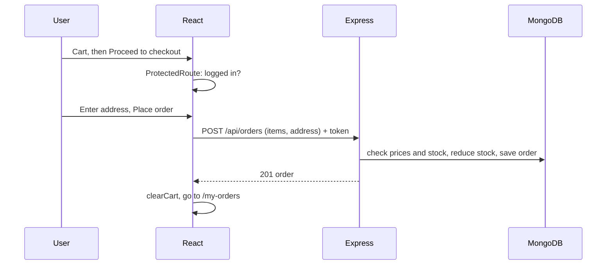

# Chapter 09 - Orders (Checkout + Order History)

**Branch:** `chapter-09-orders`

## Learning goal
Turn the cart into a real order saved in MongoDB, linked to the logged-in user.
This chapter connects **everything** built so far: products, cart and auth.

## Files added or changed
```
server/src/
  models/Order.js                 NEW      order with items, address, total, status
  controllers/orderController.js  NEW      placeOrder, getMyOrders
  routes/orderRoutes.js           NEW      POST /api/orders, GET /api/orders/mine (logged in)
  app.js                          CHANGED  mounts /api/orders
  seed.js                         CHANGED  also clears orders
client/src/
  pages/Checkout.jsx              NEW      address form + place order
  pages/MyOrders.jsx              NEW      order history table
  pages/Cart.jsx                  CHANGED  "Proceed to checkout" button
  components/Navbar.jsx           CHANGED  "My Orders" link
  App.jsx                         CHANGED  protected routes /checkout, /my-orders
```

## Key concepts

### 1. Relations between collections
```js
user:    { type: mongoose.Schema.Types.ObjectId, ref: 'User' }
product: { type: mongoose.Schema.Types.ObjectId, ref: 'Product' }
```
An order stores the **id** of the user and of each product. We also copy
`name` and `price` into the order, so old orders still show the price the
customer paid even if the admin changes it later.

### 2. Never trust the client
The browser sends only `{ product, qty }`. The server looks up the **real
price** and stock in the database:
```js
const product = await Product.findById(item.product);
if (qty > product.countInStock) return res.status(400).json({ message: `Only ${product.countInStock} left ...` });
orderItems.push({ product: product._id, name: product.name, price: product.price, qty });
```
Otherwise anyone could edit the request in DevTools and buy a watch for Rs. 1.

### 3. Protect a whole router at once
```js
router.use(protect);          // every route below needs a login
router.post('/', placeOrder);
router.get('/mine', getMyOrders);
```
`req.user` (set by `protect`) tells us **whose** order it is.

### 4. Full flow


## How to run
```bash
cd server && npm run seed && npm run dev
cd client && npm run dev
```
Log in as `student@store.com` / `student123`, add items to the cart, check out,
and see the order in **My Orders**. Open the product again; its stock went down.

## Exercise
1. Add a `GET /api/orders/:id` route and an order details page.
2. Add a phone number field to the order (model, Checkout form, MyOrders table).
