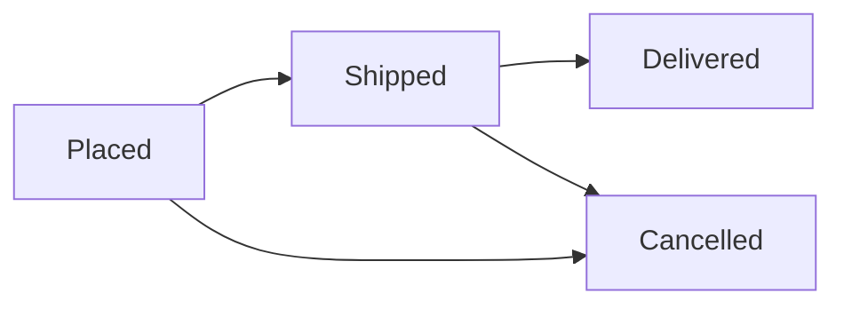

# Chapter 11 - Admin Order Management

**Branch:** `chapter-11-admin-orders`

## Learning goal
Let the admin see **every** order and move it through its life cycle
(Placed, Shipped, Delivered, or Cancelled). This chapter is the solution to the
chapter 10 exercises.

## Files added or changed
```
server/src/
  models/Order.js                 CHANGED  ORDER_STATUSES list + enum on status
  controllers/orderController.js  CHANGED  getAllOrders, updateOrderStatus
  routes/orderRoutes.js           CHANGED  GET /api/orders, PUT /api/orders/:id/status (admin)
client/src/
  pages/AdminOrders.jsx           NEW      all orders table with a status dropdown
  pages/Admin.jsx                 CHANGED  "Manage orders" link
  App.jsx                         CHANGED  route /admin/orders (admin only)
```
No new packages.

## Key concepts

### 1. One list of allowed values
```js
export const ORDER_STATUSES = ['Placed', 'Shipped', 'Delivered', 'Cancelled'];
status: { type: String, enum: ORDER_STATUSES, default: 'Placed' },
```
The model owns the list. The controller imports it to validate input, so a
typo like `"Shiped"` is rejected with **400 Invalid status**.

### 2. `populate` joins related data
```js
Order.find().populate('user', 'name email')
```
An order only stores the user's **id**. `populate` replaces it with the user's
`name` and `email` so the admin can see who ordered. (Password is never selected.)

### 3. Business rules live in the controller
```js
if (order.status === 'Cancelled') return res.status(400).json({ message: 'Cancelled orders cannot be changed' });

if (status === 'Cancelled') {
  for (const item of order.items) {
    await Product.findByIdAndUpdate(item.product, { $inc: { countInStock: item.qty } });
  }
}
```
- Cancelling an order puts the items **back in stock**.
- A cancelled order is final, so stock can never be returned twice.

### 4. Same router, different guards
```js
router.use(protect);                                   // everything needs login
router.get('/mine', getMyOrders);                      // any customer
router.get('/', admin, getAllOrders);                  // admin only
router.put('/:id/status', admin, updateOrderStatus);   // admin only
```

### 5. Status flow
The normal path is shown below. To keep the code short, the only rule the
server enforces is "Cancelled is final"; the admin can otherwise pick any status.


## How to run
1. Log in as `student@store.com` / `student123` and place an order.
2. Log out, log in as `admin@store.com` / `admin123`, open **Admin**, then **Manage orders**.
3. Change the status to **Shipped**. Log in as the student again; **My Orders** shows "Shipped".
4. Cancel an order and check that the product's stock went back up.

API test:
```bash
curl http://localhost:5050/api/orders -H "Authorization: Bearer <admin-token>"
curl -X PUT http://localhost:5050/api/orders/<order-id>/status \
  -H "Authorization: Bearer <admin-token>" -H "Content-Type: application/json" \
  -d '{"status":"Shipped"}'
```

## Exercise
1. Let a customer cancel their **own** order while it is still "Placed".
2. Add a filter dropdown on the Admin Orders page to show only one status.
