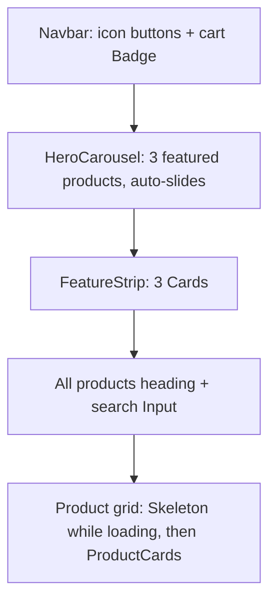

# Chapter 12 - Home Page with shadcn/ui

**Branch:** `chapter-12-shadcn-home`

## Learning goal
Make the shop look like a real product. We add **Tailwind CSS** and the
**shadcn/ui** component library, then rebuild the Home page with an
auto-sliding hero carousel, a feature strip, a search box, loading skeletons
and nicer product cards.



## Files added or changed
```
client/
  package.json                    CHANGED  new packages (see below)
  vite.config.js                  CHANGED  tailwindcss() plugin + "@" alias
  jsconfig.json                   NEW      tells the editor and shadcn CLI what "@" means
  components.json                 NEW      shadcn settings (style, paths, tsx: false)
  src/
    index.css                     CHANGED  Tailwind + shadcn theme, old CSS moved into a layer
    lib/utils.js                  NEW      the cn() helper
    components/ui/                NEW      button, card, badge, carousel, input, skeleton (from shadcn)
    components/HeroCarousel.jsx   NEW      auto-sliding banner of featured products
    components/FeatureStrip.jsx   NEW      Free delivery / Cash on Delivery / Easy returns cards
    components/ProductCard.jsx    CHANGED  shadcn Card, stock Badge, Add to cart button
    components/Navbar.jsx         CHANGED  sticky header, ghost buttons, icons, cart Badge
    pages/Home.jsx                CHANGED  hero + features + search + skeletons + grid
    App.jsx                       CHANGED  <main> uses Tailwind classes instead of .container
```
The server does not change. Only the Home page, Navbar and ProductCard use
shadcn. The other pages keep the old CSS for now.

## New packages
| Package | Why |
| --- | --- |
| `tailwindcss`, `@tailwindcss/vite` | Tailwind CSS v4 and its Vite plugin |
| `shadcn` | the CLI, plus `shadcn/tailwind.css` that the theme imports |
| `radix-ui` | accessible building blocks under shadcn (for example `Slot` for `asChild`) |
| `class-variance-authority` | defines button and badge variants |
| `cn` | merges class names (used by `cn()`) |
| `lucide-react` | icons |
| `tw-animate-css`, `@fontsource-variable/geist` | animations and the Geist font |
| `embla-carousel-react`, `embla-carousel-autoplay` | the carousel engine and its autoplay plugin |

## How we set it up
```bash
cd client
npm i tailwindcss @tailwindcss/vite
# 1. add tailwindcss() + the "@" alias to vite.config.js
# 2. add jsconfig.json
# 3. put @import "tailwindcss"; at the top of src/index.css
npx shadcn@latest init -b radix -p nova       # writes components.json, lib/utils.js, theme CSS
npx shadcn@latest add button card badge carousel input skeleton
npm i embla-carousel-autoplay
```
> Windows tip: if `npx shadcn` fails with "'npm' is not recognized" from Git
> Bash, run the same command from PowerShell or CMD instead.

## Key concepts

### 1. shadcn is code you own, not a package
`npx shadcn add button` **copies** `button.jsx` into `src/components/ui/`.
There is no `import { Button } from 'shadcn'`. Instead:
```jsx
import { Button } from '@/components/ui/button';
```
Because the file is ours, we can open it and change colours, sizes or
behaviour. `components.json` remembers our choices (JavaScript, not
TypeScript, `tsx: false`) so every new component uses the same setup.

### 2. Tailwind utility classes and `cn()`
Instead of writing CSS rules, we put small classes straight on the element:
```jsx
<div className="grid gap-6 sm:grid-cols-2 lg:grid-cols-3">
```
- `grid gap-6` gives a grid with spacing.
- `sm:` and `lg:` apply only on wider screens. The grid has 1 column on
  phones, 2 on tablets and 3 on laptops.

`cn()` (in `src/lib/utils.js`) joins class names and lets later classes win,
so a component can accept extra classes from its parent:
```jsx
<CarouselNext className="right-4" />   // replaces the default -right-12
```

### 3. The `@` import alias
```js
// vite.config.js
resolve: { alias: { '@': fileURLToPath(new URL('./src', import.meta.url)) } }
```
`@/components/ui/card` always means `src/components/ui/card`, so we never
write `../../components/...`. `jsconfig.json` tells the editor and the shadcn
CLI about the same alias.

### 4. Carousel + Autoplay plugin
```jsx
const autoplay = useRef(Autoplay({ delay: 3000, stopOnMouseEnter: true, stopOnInteraction: false }));

<Carousel opts={{ loop: true }} plugins={[autoplay.current]}>
  <CarouselContent>
    {products.map((p) => <CarouselItem key={p._id}>...</CarouselItem>)}
  </CarouselContent>
  <CarouselPrevious className="left-4" />
  <CarouselNext className="right-4" />
</Carousel>
```
- `loop: true` goes back to the first slide after the last one.
- The plugin moves to the next slide every 3 seconds and pauses while the
  mouse is over the banner.
- `useRef` keeps one plugin object. Without it, every render would create a
  new one and restart the timer.

The Home page picks the featured products from data we already have:
```jsx
const featured = products.filter((p) => p.countInStock > 0).slice(0, 3);
```

### 5. `asChild`: a Link that looks like a Button
```jsx
<Button asChild variant="ghost">
  <Link to="/cart">Cart</Link>
</Button>
```
`asChild` gives the button's styles to its child, so we get a real `<a>`
(React Router link) with the button look, not a `<button>` inside an `<a>`.

### 6. Loading skeletons and search
```jsx
{loading ? <Skeleton className="h-72 rounded-2xl" /> : <HeroCarousel products={featured} />}

const filtered = products.filter((p) => p.name.toLowerCase().includes(search.toLowerCase()));
```
Grey placeholder shapes show while products load, so the page does not jump.
Search filters in the browser, with no extra API call.

### 7. CSS layers: why `.grid` and `.container` had to go
Tailwind has its own `grid` and `container` classes. Our old `.grid` rule
would have forced its column layout onto **every** element with the Tailwind
`grid` class. So:
- `.grid`, `.card`, `.card-body`, `.navbar` and `.container` were deleted
  (their components now use Tailwind).
- The remaining old rules (`.btn`, `.form`, `.table`, `.details`, ...) moved
  into `@layer components`. Tailwind utilities live in a later layer, so
  they always win if both apply.
- Tailwind's reset removes heading sizes, so a small `@layer base` block
  brings back `h1`, `h2` and `h3` styles for the older pages.

## How to run
Same as before (server + client):
```bash
cd server && npm run dev        # terminal 1
cd client && npm install && npm run dev   # terminal 2
```
Open http://localhost:3000:
1. The banner slides every 3 seconds. Hover over it to pause, or use the arrows.
2. Type "sh" in the search box. Only "Running Shoes" stays.
3. Click **Add to cart** on a card. The cart badge in the Navbar goes up.
4. The Desk Lamp card shows **Out of stock** and its button is disabled.
5. Open Cart, Login and Admin. They still work with the old styles.

## Exercise
1. Add a price-range filter with `npx shadcn add slider`. Keep `[min, max]`
   in state and filter products whose price is between them.
2. Use shadcn `Tabs` (`npx shadcn add tabs`) to switch the grid between
   "All" and "In stock".
