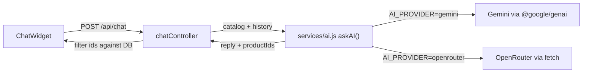

# Chapter 13 (alt) - AI Shopping Assistant with Gemini or OpenRouter

**Branch:** `chapter-13-ai-chat-openrouter` (created from `chapter-12-shadcn-home`)

> This is an alternative version of Chapter 13. The chat looks and works the
> same as `chapter-13-ai-chat`, but the server can talk to **two** AI
> providers. You choose one with `AI_PROVIDER` in `server/.env`.

## Learning goal
Add a chat bubble in the bottom-right corner of every page. The customer types
what they want ("a gift under Rs. 1000", "something for running") and an AI
answers with real products from our database, each with a **View** link and an
**Add to cart** button. The AI is called from our Express server, so the API
key never reaches the browser. We also learn how to keep our code independent
of one AI company by hiding the provider behind one small function.



## Files added or changed
```
server/
  package.json                       CHANGED  @google/genai (only needed for Gemini)
  .env.example                       CHANGED  AI_PROVIDER, GEMINI_*, OPENROUTER_*
  src/services/ai.js                 NEW      askAI(): talks to Gemini or OpenRouter
  src/controllers/chatController.js  NEW      builds the prompt, calls askAI(), checks the answer
  src/routes/chatRoutes.js           NEW      POST /api/chat
  src/app.js                         CHANGED  app.use('/api/chat', chatRoutes)
client/
  src/components/ChatWidget.jsx      NEW      floating button + chat panel + product rows
  src/App.jsx                        CHANGED  renders <ChatWidget /> on every page
```

## New package
| Package | Why |
| --- | --- |
| `@google/genai` (server) | official Google Gen AI SDK, used when `AI_PROVIDER=gemini` |

OpenRouter needs **no package**. We call its REST API with the `fetch` that
is built into Node 18+. The client needs nothing new either. The chat panel is
built from the shadcn `Card`, `Button` and `Input` we added in Chapter 12.

## Choosing a provider
Everything is set in `server/.env`:
```
AI_PROVIDER=openrouter            # gemini | openrouter

GEMINI_API_KEY=
GEMINI_MODEL=gemini-2.5-flash

OPENROUTER_API_KEY=
OPENROUTER_MODEL=openai/gpt-4o
```
Only the key for the chosen provider is needed. Restart the server after
changing `.env` (nodemon does not watch it, so type `rs` in the server
terminal).

| | Gemini | OpenRouter |
| --- | --- | --- |
| Get a key | https://aistudio.google.com/apikey | https://openrouter.ai/keys |
| Cost | free tier | pay per use (some `:free` models) |
| Models | Google Gemini only | hundreds: OpenAI, Anthropic, Google, Meta, ... |
| How we call it | `@google/genai` SDK | plain `fetch` |

With OpenRouter you can try another model by changing one line, for example
`OPENROUTER_MODEL=openai/gpt-4o-mini` (cheaper) or
`OPENROUTER_MODEL=google/gemini-2.5-flash`.

> Never commit `.env` and never paste a key into chat, code or screenshots.
> If a key leaks, delete it on the provider's website and create a new one.

> Windows tip: if `npm install` fails with "'node' is not recognized" while
> running a `protobufjs` postinstall script, run `npm i --ignore-scripts`.
> That script is optional.

## Key concepts

### 1. Keep the key on the server
The browser could call the AI directly, but then anyone could open DevTools
and copy our key. Instead the browser calls **our** API:
```
Browser  --POST /api/chat-->  Express  --(key from .env)-->  Gemini or OpenRouter
```
If the key for the chosen provider is missing, the server answers `503` and
names the variable to add ("Add OPENROUTER_API_KEY to server/.env.").

### 2. One function, many providers
The controller does not know which AI it is talking to. It only calls:
```js
const { reply, productIds } = await askAI({ instruction, messages });
```
`services/ai.js` decides who answers:
```js
export const askAI = ({ instruction, messages }) =>
  getProvider() === 'gemini' ? askGemini({ instruction, messages }) : askOpenRouter({ instruction, messages });
```
Both functions take the same input and return the same `{ reply, productIds }`
shape. To add a third provider later, you write one more `askXyz()` function
and nothing else changes.

### 3. Two APIs, same idea
| | Gemini (`askGemini`) | OpenRouter (`askOpenRouter`) |
| --- | --- | --- |
| Call | `ai.models.generateContent(...)` | `fetch('https://openrouter.ai/api/v1/chat/completions')` |
| Auth | `new GoogleGenAI({ apiKey })` | header `Authorization: Bearer <key>` |
| Rules for the AI | `config.systemInstruction` | first message `{ role: 'system' }` |
| AI's role name | `model` | `assistant` |
| Force JSON | `responseMimeType` + `responseSchema` | `response_format: { type: 'json_schema' }` |
| Read the answer | `result.text` | `data.choices[0].message.content` |

The OpenRouter call is the same **OpenAI Chat Completions** format that many
providers use (OpenAI, Groq, Together, Ollama...):
```js
const res = await fetch('https://openrouter.ai/api/v1/chat/completions', {
  method: 'POST',
  headers: {
    'Content-Type': 'application/json',
    Authorization: `Bearer ${process.env.OPENROUTER_API_KEY}`,
  },
  body: JSON.stringify({
    model: process.env.OPENROUTER_MODEL || 'openai/gpt-4o',
    messages: [
      { role: 'system', content: instruction },
      ...messages.map((m) => ({ role: m.role, content: m.text })),
    ],
    response_format: {
      type: 'json_schema',
      json_schema: { name: 'shop_reply', strict: true, schema: { /* reply + productIds */ } },
    },
  }),
});
if (!res.ok) throw new Error(`OpenRouter ${res.status}: ${await res.text()}`);
const data = await res.json();
return JSON.parse(data.choices[0].message.content);
```
`fetch` does **not** throw on a 401 or 500 the way axios does, so we check
`res.ok` ourselves.

### 4. Grounding: give the AI our catalog
On its own, an AI model knows nothing about our shop. If we just ask "suggest
a backpack", it may invent products. So before every call we load the products
from MongoDB and put them in the instruction:
```js
const catalog = products
  .map((p) => `- id: ${p._id} | ${p.name} | Rs. ${p.price} | stock: ${p.countInStock} | ${p.description}`)
  .join('\n');
```
The instruction also sets the rules: recommend only from this list, at most 3
products, say when something is out of stock, and keep the answer short.

### 5. Structured output and never trusting the AI blindly
Both providers are told to reply in this JSON shape:
```json
{ "reply": "Try our Running Shoes for Rs. 2999.", "productIds": ["66f..."] }
```
The model can still make mistakes, such as a wrong or made-up id. So the server
keeps only ids that match a real product and sends the **real** product objects
(real price, real stock):
```js
const picked = products.filter((p) => productIds.includes(String(p._id)));
res.json({ reply, products: picked });
```
The AI call is wrapped in `try/catch`, so a bad key, an empty balance or a
network problem becomes a friendly `502` for the user. The real error is
printed in the server terminal.

### 6. Chat history: the AI has no memory
Every request is independent. To let the customer say "show me a cheaper one",
the client sends the **whole conversation** each time, and the server keeps
only the last 10 messages, so prompts stay small:
```json
{ "messages": [
  { "role": "user", "text": "something for running" },
  { "role": "assistant", "text": "Try our Running Shoes for Rs. 2999." },
  { "role": "user", "text": "anything cheaper?" }
] }
```

### 7. The floating widget
```jsx
<div className="fixed right-6 bottom-6 z-50 flex flex-col items-end gap-3">
  {open && <Card className="h-[32rem] w-80 sm:w-96">...</Card>}
  <Button className="size-14 rounded-full">...</Button>
</div>
```
- `fixed right-6 bottom-6` pins it to the corner on every page, and `z-50`
  keeps it above the content.
- It is rendered once in `App.jsx`, outside `<Routes>`, so it keeps its
  messages while you move between pages.
- Assistant messages with `products` show a small row per product with
  **View** and **Add to cart** (`useCart().addToCart`).
- Error replies are shown in red but are **not** sent back to the AI.

## How to run
```bash
cd server && npm run dev        # terminal 1
cd client && npm run dev        # terminal 2
```
Open http://localhost:3000 and click the round chat button:
1. Click **Something for running**. The AI suggests Running Shoes, and its
   cart button adds it (the Navbar badge goes up).
2. Ask "do you have a desk lamp?". The AI says it is out of stock, and its
   cart button is disabled.
3. Ask "anything cheaper?". The AI remembers the conversation.
4. Change `AI_PROVIDER` to `gemini` (with a Gemini key) and restart the server.
   The same questions still work, now answered by Gemini.
5. Empty the key of the active provider and restart. The chat says which
   variable to add instead of breaking.

## Exercise
1. Add a third provider to `askAI()`. Groq (https://console.groq.com) and
   Ollama (`http://localhost:11434/v1/chat/completions`) both use the same
   OpenAI format, so you can copy `askOpenRouter()` and change the URL, key
   and model.
2. If the main provider fails, try the other one before returning `502`
   (a "fallback").
3. Show the provider and model name in small text at the bottom of the chat
   panel (return them from `/api/chat`).
