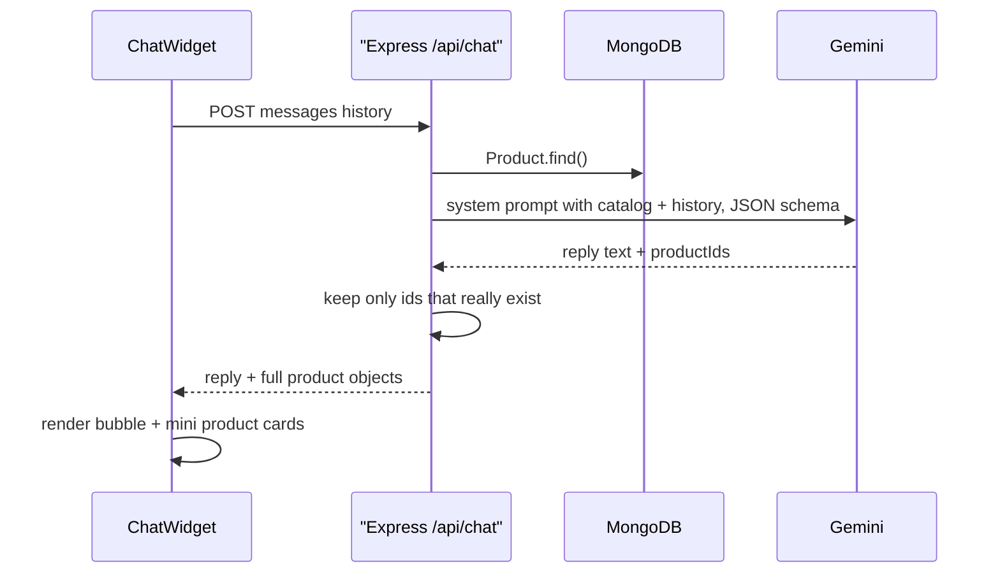

# Chapter 13 - AI Shopping Assistant (Gemini)

**Branch:** `chapter-13-ai-chat`

## Learning goal
Add a chat bubble in the bottom-right corner of every page. The customer types
what they want ("a gift under Rs. 1000", "something for running") and an AI
answers with real products from our database, each with a **View** link and an
**Add to cart** button. We use **Google Gemini** through our own Express
server, so the API key never reaches the browser.



## Files added or changed
```
server/
  package.json                       CHANGED  @google/genai
  .env.example                       CHANGED  GEMINI_API_KEY, GEMINI_MODEL
  src/controllers/chatController.js  NEW      builds the prompt, calls Gemini, checks the answer
  src/routes/chatRoutes.js           NEW      POST /api/chat
  src/app.js                         CHANGED  app.use('/api/chat', chatRoutes)
client/
  src/components/ChatWidget.jsx      NEW      floating button + chat panel + product rows
  src/App.jsx                        CHANGED  renders <ChatWidget /> on every page
```

## New package
| Package | Why |
| --- | --- |
| `@google/genai` (server) | official Google Gen AI SDK for calling Gemini |

The client needs no new package. The chat panel is built from the shadcn
`Card`, `Button` and `Input` we added in Chapter 12.

## Setup: get a free Gemini key
1. Open https://aistudio.google.com/apikey and sign in with a Google account.
2. Click **Create API key** and copy it.
3. Paste it into `server/.env`:
```
GEMINI_API_KEY=your_key_here
GEMINI_MODEL=gemini-2.5-flash
```
4. Install the package and restart the server:
```bash
cd server
npm i @google/genai
npm run dev
```
> Never commit `.env`. It is already listed in `.gitignore`.

> Windows tip: if `npm install` fails with "'node' is not recognized" while
> running a `protobufjs` postinstall script, run `npm i --ignore-scripts`.
> That script is optional.

## Key concepts

### 1. Keep the key on the server
The browser could call Gemini directly, but then anyone could open DevTools and
copy our key. Instead the browser calls **our** API:
```
Browser  --POST /api/chat-->  Express  --(key from .env)-->  Gemini
```
The server reads `process.env.GEMINI_API_KEY`. If the key is missing, it
answers `503` with a helpful message instead of crashing.

### 2. Grounding: give the AI our catalog
On its own, an AI model knows nothing about our shop. If we just ask "suggest
a backpack", it may invent products. So before every call we load the products
from MongoDB and put them in the **system instruction**:
```js
const catalog = products
  .map((p) => `- id: ${p._id} | ${p.name} | Rs. ${p.price} | stock: ${p.countInStock} | ${p.description}`)
  .join('\n');
```
The instruction also sets the rules: recommend only from this list, at most 3
products, say when something is out of stock, and keep the answer short.
Our catalog is small, so it fits in one prompt. A big shop would search first
and send only the closest matches.

### 3. Structured output: JSON instead of free text
We need two things back: a sentence for the customer and the ids of the
products to show. Asking for JSON with a **schema** makes Gemini always reply
in that shape:
```js
const result = await ai.models.generateContent({
  model: process.env.GEMINI_MODEL || 'gemini-2.5-flash',
  contents,
  config: {
    systemInstruction: buildInstruction(products),
    responseMimeType: 'application/json',
    responseSchema: {
      type: Type.OBJECT,
      properties: {
        reply: { type: Type.STRING },
        productIds: { type: Type.ARRAY, items: { type: Type.STRING } },
      },
      required: ['reply', 'productIds'],
    },
  },
});
const { reply, productIds = [] } = JSON.parse(result.text);
```

### 4. Never trust the AI blindly
The model can still make mistakes, such as a wrong or made-up id. So the server
only keeps ids that match a real product, and it sends the **real** product
objects from the database (real price, real stock):
```js
const picked = products.filter((p) => productIds.includes(String(p._id)));
res.json({ reply, products: picked });
```
We also check the request body (`messages` must be a list of
`{ role, text }`) and wrap the Gemini call in `try/catch`, so a network or key
problem becomes a friendly `502` message.

### 5. Chat history: the AI has no memory
Every request is independent. To let the customer say "show me a cheaper one",
the client sends the **whole conversation** each time:
```json
{ "messages": [
  { "role": "user", "text": "something for running" },
  { "role": "assistant", "text": "Try our Running Shoes for Rs. 2999." },
  { "role": "user", "text": "anything cheaper?" }
] }
```
The server keeps only the last 10 messages, so prompts stay small, and renames
`assistant` to `model`, which is the word Gemini uses.

### 6. The floating widget
```jsx
<div className="fixed right-6 bottom-6 z-50 flex flex-col items-end gap-3">
  {open && <Card className="h-[32rem] w-80 sm:w-96">...</Card>}
  <Button className="size-14 rounded-full">...</Button>
</div>
```
- `fixed right-6 bottom-6` pins it to the corner on every page, and `z-50`
  keeps it above the content.
- It is rendered once in `App.jsx`, outside `<Routes>`, so it stays open (and
  keeps its messages) while you move between pages.
- Each message is `{ role, text, products? }`. Assistant messages with
  `products` show a small row per product with **View** and **Add to cart**
  (`useCart().addToCart`, the same function `ProductCard` uses).
- A `useRef` on an empty `<div>` at the bottom plus `scrollIntoView` keeps the
  newest message visible.
- Error replies are shown in red but are **not** sent back to the AI as
  history.

## How to run
```bash
cd server && npm run dev        # terminal 1
cd client && npm run dev        # terminal 2
```
Open http://localhost:3000 and click the round chat button:
1. Click the chip **Something for running**. The AI suggests Running Shoes, and
   the card's cart button adds it (the Navbar badge goes up).
2. Ask "do you have a desk lamp?". The AI says it is out of stock, and its
   cart button is disabled.
3. Ask "anything cheaper?". The AI remembers what you talked about.
4. Click **View** on a product. The product page opens and the chat closes.
5. Remove `GEMINI_API_KEY` from `.env` and restart the server. The chat shows
   "The AI assistant is not set up yet..." instead of breaking.

## Exercise
1. Save `messages` in `localStorage` (like the cart in Chapter 6) so the chat
   survives a page refresh. Add a "Clear chat" button.
2. Show replies word by word with `ai.models.generateContentStream` and a
   streaming response.
3. Protect your free quota: allow at most 10 chat requests per minute per IP
   with the `express-rate-limit` package.
