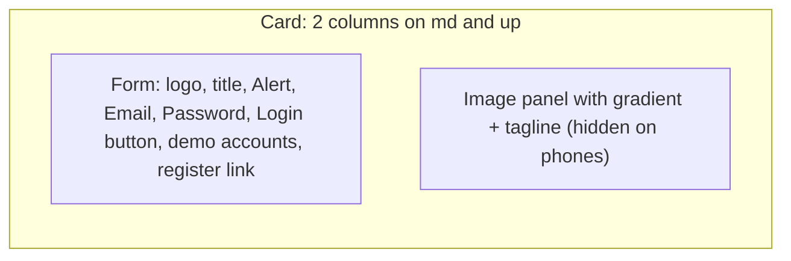

# Chapter 14 - A Better Login Page

**Branch:** `chapter-14-login-ui`

## Learning goal
Rebuild the Login page with shadcn/ui so it matches the new Home page. We
learn how to build a good-looking, friendly form: labels, icons inside inputs,
a show/hide password button, a loading state, a proper error alert, one-click
demo accounts and a split layout that adapts to the screen size.



## Files added or changed
```
client/
  src/components/ui/label.jsx    NEW      shadcn Label (from Radix)
  src/components/ui/alert.jsx    NEW      shadcn Alert for the error message
  src/pages/Login.jsx            CHANGED  new design, no more .form / .btn classes
```
The server and the login logic (`AuthContext`) do not change. This chapter
is only about the UI.

## How we set it up
```bash
cd client
npx shadcn@latest add label alert
```
> Windows tip: if `npx` says "'node' is not recognized", run the CLI that is
> already installed: `node node_modules/shadcn/dist/index.js add label alert`.

## Key concepts

### 1. A split layout with one Card
```jsx
<Card className="mx-auto grid max-w-4xl gap-0 overflow-hidden p-0 md:grid-cols-2">
  <form className="p-6 sm:p-10">...</form>
  <div className="relative hidden md:block">...image...</div>
</Card>
```
- On phones, the card has one column and the image panel is `hidden`.
- From `md` (768px) up, `md:grid-cols-2` puts the form and the image side by side,
  and `md:block` shows the image.
- `overflow-hidden` clips the image to the card's rounded corners.

### 2. Labels that belong to inputs
```jsx
<Label htmlFor="email">Email</Label>
<Input id="email" type="email" autoComplete="email" ... />
```
`htmlFor` and `id` connect the two. Clicking the label focuses the input, and
screen readers read "Email" for that field. `autoComplete` lets the browser
offer saved emails and passwords.

### 3. An icon inside an input
```jsx
<div className="relative">
  <Mail className="pointer-events-none absolute top-1/2 left-3 size-4 -translate-y-1/2" />
  <Input className="h-10 pl-9" />
</div>
```
The wrapper is `relative`, so the icon can be placed `absolute` inside it.
`top-1/2 -translate-y-1/2` centres it vertically, and `pl-9` adds left padding
so the text does not go under the icon. `pointer-events-none` lets clicks pass
through the icon to the input.

### 4. Show / hide password
```jsx
const [showPassword, setShowPassword] = useState(false);

<Input type={showPassword ? 'text' : 'password'} />
<Button type="button" onClick={() => setShowPassword((s) => !s)}>
  {showPassword ? <EyeOff /> : <Eye />}
</Button>
```
Switching `type` between `password` and `text` is all it takes.
`type="button"` is important: a plain `<button>` inside a form is a **submit**
button by default, so without it every click on the eye would try to log in.

### 5. Loading state and error Alert
```jsx
<Button type="submit" disabled={loading}>
  {loading && <Loader2 className="animate-spin" />}
  {loading ? 'Logging in...' : 'Login'}
</Button>

{error && (
  <Alert variant="destructive">
    <AlertCircle />
    <AlertDescription>{error}</AlertDescription>
  </Alert>
)}
```
While the request runs, the button is disabled, so a double click cannot send
two logins. If the server answers 401, its message ("Invalid email or
password") appears in a red Alert above the form.

### 6. Redirect with `<Navigate>` instead of `navigate()`
```jsx
if (user) return <Navigate to={location.state?.from || '/'} replace />;
```
One line handles both cases:
- If you are already logged in and open `/login`, you are sent away.
- After a successful `login()`, `user` changes, the page re-renders and the
  same line sends you to the page you came from (for example `/checkout`,
  which `ProtectedRoute` saved in `location.state.from`).

### 7. Demo account buttons
```jsx
const DEMO_ACCOUNTS = [
  { label: 'Admin', email: 'admin@store.com', password: 'admin123' },
  { label: 'Student', email: 'student@store.com', password: 'student123' },
];
```
Clicking one only **fills** the form. You still press Login, so you see the
normal flow. These are the accounts `npm run seed` creates. A real shop would
never show passwords like this. It is only for the classroom.

## How to run
```bash
cd server && npm run dev        # terminal 1
cd client && npm run dev        # terminal 2
```
Log out and open http://localhost:3000/login:
1. On a wide window, the form is on the left and the image on the right. Make
   the window narrow and the image disappears.
2. Type `admin@store.com` and a wrong password. Click the eye to see what you
   typed, then press Login. The button shows a spinner, and then a red alert
   says "Invalid email or password".
3. Click **Student**, then **Login**. You go to the Home page and the Navbar
   says "Hi, Student".
4. While logged in, open `/login` again. You are sent back to Home.
5. Log out, open `/checkout` (a protected page) and log in. You come back to
   Checkout, not Home.

## Exercise
1. Restyle `Register.jsx` the same way. Add a `User` icon for the name field
   and reuse the same Card layout.
2. Pull the "input with an icon" pattern out into a small `IconInput`
   component and use it for every field.
3. Add a "Remember me" checkbox with `npx shadcn add checkbox`.
